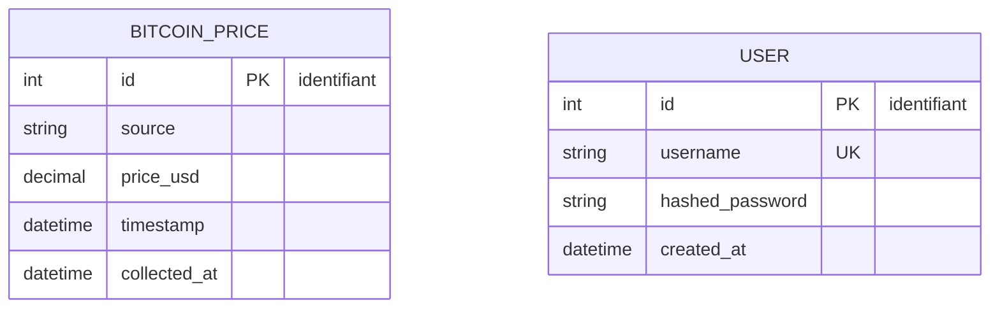

# BitcoinPipeline — Modélisation Merise (C4)

## Contexte

BitcoinPipeline stocke le résultat de l'agrégation multi-sources (5
exchanges/méthodes de collecte) dans une base PostgreSQL unique
(bitcoin_db). Deux entités suffisent : le prix normalisé, et le compte
administrateur nécessaire pour sécuriser l'API (C5).

## MCD — Modèle Conceptuel de Données

### Diagramme



Aucune ligne de relation entre BITCOIN_PRICE et USER sur ce diagramme, et donc
aucune cardinalité à noter entre les deux : ce sont deux entités totalement
indépendantes, la table USER ne sert qu'à l'authentification de l'API, pas à
qualifier les données de prix. L'absence de relation est elle-même un choix
de modélisation assumé (voir tableau "Choix de modélisation" ci-dessous),
pas un oubli.

### Entités et attributs

BITCOIN_PRICE

id (identifiant)
source
price_usd
timestamp
collected_at

USER

id (identifiant)
username
hashed_password
created_at

## MPD — Modèle Physique de Données

```sql
CREATE TABLE IF NOT EXISTS bitcoin_prices (
    id SERIAL PRIMARY KEY,
    source VARCHAR(50) NOT NULL,
    price_usd NUMERIC(12, 2) NOT NULL,
    timestamp TIMESTAMPTZ NOT NULL,
    collected_at TIMESTAMPTZ NOT NULL
);

CREATE TABLE IF NOT EXISTS users (
    id SERIAL PRIMARY KEY,
    username VARCHAR(100) UNIQUE NOT NULL,
    hashed_password VARCHAR(255) NOT NULL,
    created_at TIMESTAMP DEFAULT NOW()
);
```

## Choix de modélisation

| Décision | Justification |
|---|---|
| `source` en VARCHAR plutôt qu'une table SOURCE séparée | 5 valeurs fixes et connues (api_coingecko, scraping_kraken, file_coinbase, db_bitstamp, bigdata_bitfinex) ; une table de référence serait sur-ingénierie pour ce volume |
| `price_usd` en NUMERIC(12,2) | Précision décimale garantie (contrairement à FLOAT), 2 décimales suffisantes pour un prix en USD |
| `timestamp`/`collected_at` en TIMESTAMPTZ | Stocke le fuseau horaire explicitement (UTC), cohérent avec le format ISO 8601 + Z produit par normalize.py |
| Pas de clé étrangère entre BITCOIN_PRICE et USER | Aucune relation métier entre les deux ; les mélanger introduirait un couplage artificiel |
| Table `historical_prices_bitstamp` (créée en brique 6) non reprise ici | C'est une table de préparation/test pour le collector BDD, pas une donnée finale du pipeline — elle reste dans son propre script de seed |
| Tables `coinbase_prices` et `bitstamp_prices_2022_sample` non reprises ici | Tables de préparation pour la jointure SQL multi-sources documentée dans `docs/sql_queries.md` (Requête 5) et `src/aggregate_sql.py` — même raison que `historical_prices_bitstamp` : ce ne sont pas des données finales du pipeline |
